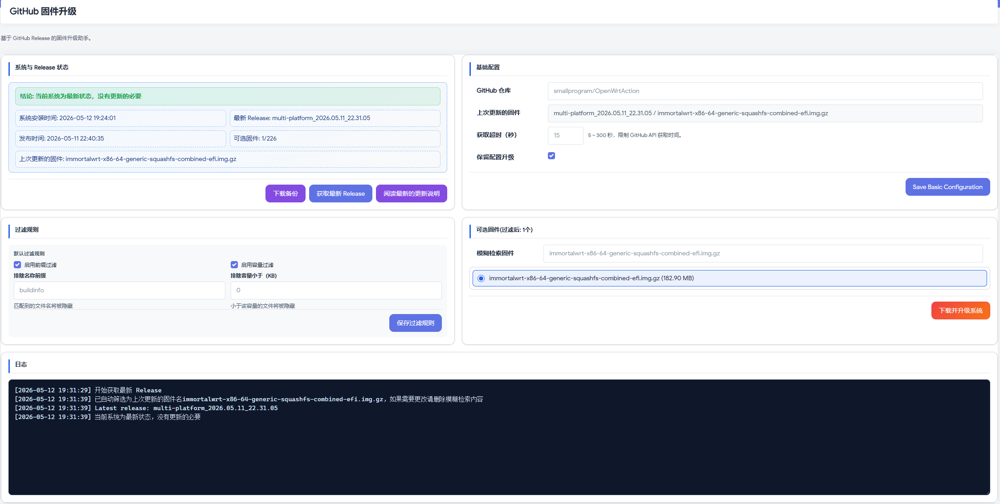
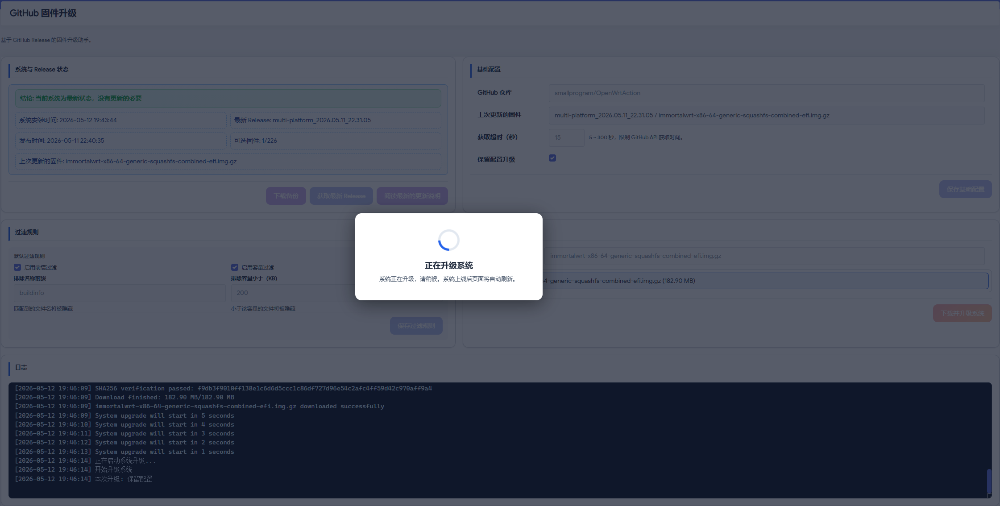

<div align="center">

# 🚀 luci-app-ghfu
**LuCI Github Firmware Update**

*基于 GitHub Release 的 OpenWrt / ImmortalWrt 一键固件升级插件*<br>
*One-Click OpenWrt Firmware Upgrade via GitHub Releases*

[](https://github.com/smallprogram/luci-app-ghfu)
[](LICENSE)
[](https://openwrt.org/)

[🇨🇳 中文说明](#-中文说明) • [🇬🇧 English](#-english) • [🛠️ 安装说明](#-quick-start--快速开始)

</div>

---

### 📸 界面预览 | Screenshots

> 💡 **想要直接体验？** 欢迎使用集成了该插件的固件：[smallprogram/OpenWrtAction](https://github.com/smallprogram/OpenWrtAction)

<div align="center">
  
  
</div>

---

## 🛠️ Quick Start | 快速开始

### 📦 安装 APK (Install APK)
通过命令行直接在设备上安装：
```bash
# install apk
apk add --allow-untrusted --repositories-file /dev/null /tmp/luci-app-ghfu-xxxx.apk
apk add --allow-untrusted --repositories-file /dev/null /tmp/luci-i18n-ghfu-zh-cn-xxxx.apk
```
### ⚙️ 源码编译 (Feeds Compile)
将插件加入你的 OpenWrt 编译环境中：
```
# 1. Add to feeds
src-git ghfu [https://github.com/smallprogram/luci-app-ghfu.git;main](https://github.com/smallprogram/luci-app-ghfu.git;main)

# 2. Update and install feeds
./scripts/feeds update ghfu && ./scripts/feeds install -a -p ghfu

# 3. Compile ghfu
make package/feeds/ghfu/luci-app-ghfu/compile -j$(nproc)
```
## 🇨🇳 中文说明

> `luci-app-ghfu` 是一个专为 OpenWrt / ImmortalWrt 打造的 LuCI 固件升级插件。
> 它的目标是告别繁琐的命令行和手动复制链接，让用户在路由器 Web 管理界面中，**直接基于 GitHub Release 完成固件检查、下载和升级的闭环操作**。

### ✨ 核心功能与特性

- **🌐 极简升级闭环**：在 LuCI 页面中一键获取指定 GitHub 仓库的最新 Release 信息，下载固件并自动调用 `sysupgrade` 执行系统升级。
- **📊 智能对比与展示**：自动对比当前系统刷写时间与 Release 发布时间，给出清晰的升级建议。展示固件资产列表并支持关键字筛选。
- **⚙️ 灵活的基础配置**：支持自定义 GitHub 仓库地址、获取超时时间（默认 15 秒），并支持单独保存基础配置。升级时支持“保留配置”与“不保留配置”模式。
- **🤖 智能记忆与自动筛选**：
  - 获取到最新 Release 后，会尝试根据**上次升级固件名**自动模糊筛选并选中可升级固件。
  - 若筛选结果唯一，自动选中并记录日志。
  - 若结果不唯一或找不到匹配项，清空检索框交由用户手动筛选并给出日志提示。
- **🛡️ 安全与防误触机制**：升级业务进行中会**锁定关键按钮**（保存配置、获取最新 Release、下载升级等），异常退出后自动恢复。
- **🖥️ 极佳的交互体验**：提供升级前日志可视化（下载进度、倒计时、启动提示），升级过程中弹窗等待，并在设备恢复后自动刷新页面。支持下载系统备份（与 OpenWrt 原生备份能力一致）。中英文界面完美适配。

### 🎯 适用场景

1. **固件维护者**：维护自定义固件发布仓库（GitHub Release）并希望提供友好升级方案的开发者。
2. **普通用户**：希望通过 LuCI 图形界面优雅、直观地完成固件升级的用户。
3. **运维场景**：需要在升级前后保留可追踪日志与状态信息的进阶网络环境。

---

## 🇬🇧 English

> `luci-app-ghfu` is a sleek LuCI firmware upgrade application designed for OpenWrt / ImmortalWrt.
> It allows users to check, download, and upgrade firmware directly from GitHub Releases via the router's web UI, entirely eliminating the need for manual URL handling or shell commands.

### ✨ Key Features

- **🌐 Seamless Integration**: Fetches the latest release data from a specified GitHub repository and triggers `sysupgrade` automatically upon download.
- **📊 Smart Comparison**: Compares the current system flash time with the release publish time to provide a clear upgrade suggestion. Displays release assets with keyword-based filtering.
- **⚙️ Highly Configurable**: Customizable GitHub repository input and release fetch timeout (default: 15s). Supports both **keep-config** and **no-keep-config** upgrade modes.
- **🤖 Auto-Filtering & Memory**: 
  - Automatically attempts to filter and select the correct firmware based on the filename of the *last upgraded firmware*.
  - If a unique match is found, it selects it automatically. If not, it prompts the user to select manually via detailed logs.
- **🛡️ Failsafe UI**: Locks critical operation buttons (save configs, fetch release, download/upgrade) while an upgrade process is running to prevent accidental clicks. Auto-recovers on abnormal exits.
- **🖥️ Enhanced UX**: Provides visual logs for download progress, countdowns, and upgrade trigger steps. Features a waiting dialog during the upgrade and auto-refreshes the page when the device comes back online. Fully bilingual (Chinese and English). 

### 🎯 Typical Use Cases

1. **Firmware Maintainers**: Developers distributing custom firmware via GitHub Releases who want to offer a seamless OTA-like experience.
2. **Home Users**: Users who prefer a visual, click-to-upgrade experience from LuCI over CLI maintenance.
3. **Operations**: Workflows requiring visible status and precise logs around network infrastructure upgrades.

---

## 📄 License | 许可证

本项目采用 **GNU General Public License v3.0 only** 许可证。
This project is licensed under the **GNU General Public License v3.0 only**.

- **SPDX**: `GPL-3.0-only`
- **License file**: [`luci-app-ghfu/LICENSE`](LICENSE)
- **Copyright** (C) 2026 [smallprogram](https://github.com/smallprogram)
